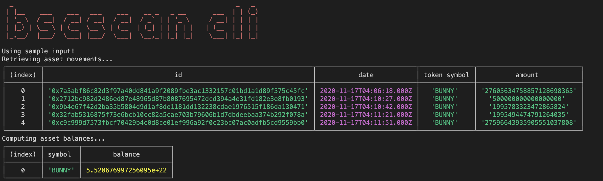

# Bscscan cli sample

The program is a CLI application which retrieves the asset movements related to a wallet address on the BNB Smart Chain.

## features

Using the bscscan API: [Introduction - BscScan](https://docs.bscscan.com/)

- it retrieve the list of all the BEP20 tokens transactions
- display the following info for each movement: transaction id, date and time, token symbol, amount
- compute the current balance of each asset using the previously retrieved data
- display a list of assets with their balance

## How to use

### Input


```bash
# npm or yarn or pnpm
$ pnpm start \
> --wallet 0x7bb89460599dbf32ee3aa50798bbceae2a5f7f6a \
> --contract 0xc9849e6fdb743d08faee3e34dd2d1bc69ea11a51 \
> --key YourApiKeyToken
```

### Output


